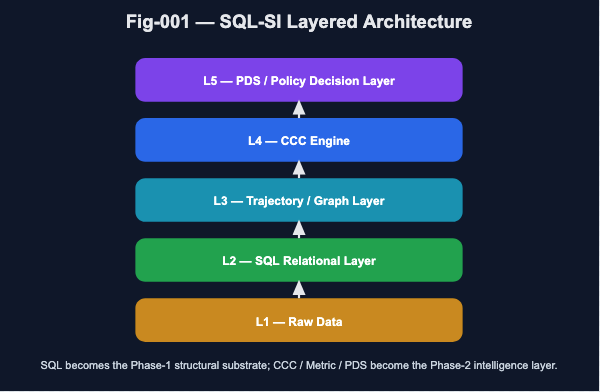
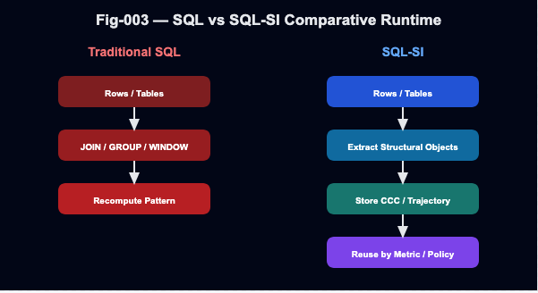

# SQL-SI
## SQL as a Structural Intelligence Backend

> A proposal and reference scaffold for extending SQL from a query engine into a CCC / Trajectory / Metric / PDS–enabled structural intelligence backend.

```text
SQL-SI = SQL + Structural Objects + Metric Space + CCC + PDS
```
## 1. Hero: 3-Second Understanding

SQL already provides a mature foundation for structured knowledge and deterministic reasoning.

However, traditional SQL systems still lack first-class support for:

- CCC: reusable structural invariants
- Trajectory: temporal and behavioral evolution
- Graph: explicit topology and motif structures
- Metric Space: distance-based comparison and search
- PDS: policy-aware decision logic

SQL-SI proposes to fill this gap.

    [ PDS / Policy Layer ]
    [ CCC Engine ]
    [ Trajectory / Graph Layer ]
    [ SQL Relational Layer ]
    [ Raw Data ]
    
### Why It Matters

SQL-SI shifts SQL from:

    rows → query → recomputed result

to:

    rows → trajectory → CCC → metric point → store → reuse

Core transition:

> From query-time recomputation to persistent structural intelligence.

## 2. Deep Theory / Architecture

### 2.1 SQL as an Intelligence Substrate

SQL is not merely a data access language.

It already provides:

- declarative reasoning
- schema-constrained knowledge representation
- deterministic execution
- query planning and cost-based decision support

In PDS terms:

    S(u) → K(SQL) → D(Query Planner)

SQL is therefore already partially aligned with the Knowledge and Decision layers of structural intelligence.

### 2.2 The Core Limitation

Traditional SQL is powerful, but it does not natively persist higher-order structural objects.

It can compute:

    JOIN
    GROUP BY
    WINDOW
    ORDER BY
    FILTER

But it does not directly store and reuse:

    CCCObject
    TrajectoryObject
    GraphObject
    MetricPoint
    PolicyObject
    EvidenceObject

As a result, important structures are repeatedly recomputed rather than accumulated, named, compared, and evolved.

### 2.3 Structural Object Layer

---



---

SQL-SI introduces a structural object layer above ordinary relational data.

Representative objects:

    CCCObject
    TrajectoryObject
    GraphObject
    MotifObject
    PolicyObject
    EvidenceObject

These objects are designed to support:

    store
    load
    reuse
    compare
    validate
    version
    explain

### 2.4 Metric Space Integration

SQL-SI treats points and distance as first-class primitives.

    MetricPoint = any object with computable distance

Examples:

    CCCPoint
    TrajectoryPoint
    GraphPoint
    PolicyStatePoint
    DecisionTracePoint

Conceptual query examples:

    SELECT *
    FROM ccc_objects
    WHERE METRIC_DISTANCE(ccc, :target) < 0.1;
    
    SELECT *
    FROM trajectories
    INFER REGIME_SHIFT;
    
    SELECT *
    FROM candidates
    DECIDE USING policy_safe;

### 2.5 Core Insight

---



---

SQL becomes the Phase-1 structural substrate.

CCC, metric distance, trajectory intelligence, and PDS become the Phase-2 intelligence layer.

    SQL rows
    → structural objects
    → CCC extraction
    → metric comparison
    → policy-aware decision

## 3. Engineering / Runtime / Demo

### 3.1 Minimal Runtime Pipeline

SQL-SI v0.1 implements a small reference pipeline:

    SQL-style event rows
    → Trajectory extraction
    → CCC discovery
    → StructuralObjectStore
    → Markdown trace
    → SQL vs SQL-SI comparison

### 3.2 Package Layout

    com.dbm.sqlsi.metric
    com.dbm.sqlsi.trajectory
    com.dbm.sqlsi.ccc
    com.dbm.sqlsi.store
    com.dbm.sqlsi.runtime
    com.dbm.sqlsi.trace
    com.dbm.sqlsi.comparative
    com.dbm.sqlsi.demo

### 3.3 Demo Capabilities

SQL-SI v0.1 can:

- extract trajectories from SQL-style event rows
- derive simple CCC signatures
- compute basic metric distance
- store structural objects
- print Markdown traces
- compare traditional SQL-like recomputation with SQL-SI structural reuse

## 4. Quick Start

Run all tests:

    mvn test

Run the runtime trace demo:

    mvn exec:java -Dexec.mainClass="com.dbm.sqlsi.demo.SqlSiMarkdownTraceDemo"

Run the SQL vs SQL-SI comparative demo:

    mvn exec:java -Dexec.mainClass="com.dbm.sqlsi.demo.SqlVsSqlSiComparativeDemo"

## 5. Experimental / Validation Section

SQL-SI v0.1 includes three minimal validation paths.

### 5.1 Runtime Trace

Raw SQL-style rows are transformed into:

- trajectory objects
- CCC objects
- persistent structural store entries

Expected conceptual output:

    EventRow
    → TrajectoryObject
    → CccObject
    → StructuralObjectStore
    → Markdown Trace

### 5.2 SQL vs SQL-SI Comparative Demo

Traditional SQL-like execution recomputes structural summaries at query time.

SQL-SI extracts and stores:

- trajectories
- CCC signatures
- stability scores

Comparison:

    Traditional SQL:
    rows → query → recomputed result

    SQL-SI:
    rows → trajectory → CCC → store → reuse

### 5.3 Core Validation Claim

This first demo validates the central SQL-SI transition:

> SQL-SI converts SQL from a recomputation-oriented query system into a reusable structural intelligence backend.

## 6. Figures

See:

    docs/FIGURE-INDEX.md

Current figure pack:

    docs/figures/fig-001-sql-si-layered-architecture.svg
    docs/figures/fig-002-sql-to-sqlsi-flow.svg
    docs/figures/fig-003-sql-vs-sqlsi-runtime.svg

Recommended figure sequence:

1. SQL-SI Layered Architecture
2. SQL to SQL-SI Flow
3. SQL vs SQL-SI Comparative Runtime

## 7. Repository Layout

    docs/
      FIGURE-INDEX.md
      figures/
        fig-001-sql-si-layered-architecture.svg
        fig-002-sql-to-sqlsi-flow.svg
        fig-003-sql-vs-sqlsi-runtime.svg
    
    src/main/java/com/dbm/sqlsi/
      metric/
      trajectory/
      ccc/
      store/
      runtime/
      trace/
      comparative/
      demo/
    
    src/test/java/com/dbm/sqlsi/
      trace/
      comparative/

## 8. Scope of v0.1

This repository is a proposal and reference scaffold.

It is not intended to be:

- a complete SQL engine
- a SQL parser
- a replacement for existing relational databases
- a production-grade graph or trajectory database

Instead, SQL-SI v0.1 demonstrates a direction:

> SQL can become a structural intelligence backend by adding persistent structural objects, metric comparison, CCC extraction, and policy-aware decision layers.

## 9. Future Work

Planned extensions include:

- JDBC-backed extraction from real SQL databases
- persistent structural object storage
- graph object and motif extraction
- trajectory similarity search
- CCC stability validation
- metric indexing
- policy-aware query execution
- Spark / Hadoop / lakehouse integration
- EvidenceChain-based runtime validation

## 10. One-Sentence Summary

SQL-SI proposes a practical path for transforming SQL from a deterministic query language into a reusable, verifiable, metric-comparable structural intelligence backend.

## 📜 Citation (Suggested)

SQL-SI v0.1 — SQL as a Structural Intelligence Backend (CCC, Trajectory, Metric, PDS Integration)\
Version: 0.1\
Year: 2026 

Author: Sizhe Tan \
Assistant: chatGPT (OpenAI)
    
License: Apache
 
DOI: TBD
 
Repository: https://github.com/sizhet/SQL-SI
   
## DBM-SI Series of gitHub Repositories

[DBM-SI-Repository-Series—Master-Narrative.md](docs/DBM-SI-Series-of-gitHub-Repositories/DBM-SI-Repository-Series—Master-Narrative.md)

## DBM-SI Core Concepts Summary by Numbers

[DBM-SI-Core-Concepts-Summary-by-Numbers.md](docs/DBM-SI-Series-of-gitHub-Repositories/DBM-SI-Core-Concepts-Summary-by-Numbers.md)
