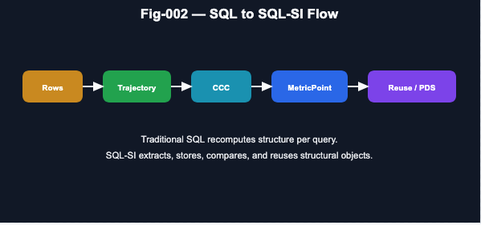

# SQL-SI
## SQL Alignment with CCC, Trajectory, Graph, and PDS
## Toward a Structural Intelligence Backend

## 1. Executive Summary

Traditional SQL systems are often perceived as static data query engines. This view is incomplete.

**SQL already implements a constrained but highly reliable form of intelligence**, particularly aligned with the **K (Knowledge)** and **D (Decision)** layers of the **Policy Decision System (PDS)**.

This document defines a forward path:

> **Transform SQL from a relational query system into a Structural Intelligence Backend (SQL-SI)**

by integrating:

- **CCC (Common Concept Core)**
- **Trajectory Intelligence**
- **Graph Structures**
- **Metric Space & Distance Computation**
- **Policy-aware Decision (PDS)**

## 2. Core Diagnosis

### 2.1 What SQL Already Is

SQL systems provide:

- Declarative query semantics
- Strong schema constraints
- Deterministic execution
- Cost-based decision planning

Thus:

> **SQL ≈ a deterministic reasoning system over structured knowledge**

Mapping to PDS:

    S(u) → K(SQL) → D(Query Planner) → (missing P, M)

### 2.2 Fundamental Limitation

SQL operates on:

    tables → joins → aggregations → projections

But lacks native support for:

- Structural invariants (CCC)
- Temporal evolution (Trajectory)
- Graph topology
- Metric similarity
- Policy-driven decision

As a result:

    Every high-level structure must be recomputed per query
    → No structural memory
    → No reuse
    → No evolution

## 3. Key Insight

This work establishes a central thesis:

> **SQL is not misaligned with AI — it is under-extended.**

More precisely:

- SQL = **Phase-1 Structural Substrate**
- CCC / Metric / PDS = **Phase-2 Intelligence Layer**

## 4. SQL-SI: Structural Intelligence Extension

We define:

    SQL-SI = SQL + Structural Objects + Metric Space + CCC + PDS

## 5. Structural Object Layer (Critical Upgrade)

### 5.1 Problem

SQL currently supports:

    Table / View / Index

But DBM-SI requires:

    Graph
    Trajectory
    CCC
    Motif
    Policy
    Evidence

### 5.2 Solution: Persistent Structural Objects

Introduce first-class objects:

#### CCC Object
    ccc_id
    invariant_signature
    stability_score
    confidence
    version
    evidence_chain

#### Trajectory Object
    trajectory_id
    entity_id
    ordered_events
    phase_segments
    regime_transitions

#### Graph Object
    graph_id
    nodes
    edges
    motifs
    path_index
    centrality_metrics

### 5.3 Key Principle

> SQL must evolve from **query recomputation → structural persistence and reuse**

---

---

## 6. Metric Space as First-Class Primitive

A decisive extension:

Distance must become a native SQL construct

### 6.1 New Core Types

    EuclideanPoint
    MetricPoint
    MetricSpace
    DistanceFunction

### 6.2 Unified Definition
    
    MetricPoint = any object with computable distance

Examples:

- CCCPoint
- TrajectoryPoint
- GraphPoint
- PolicyStatePoint

### 6.3 Query Examples

    SELECT *
    FROM metric_points
    ORDER BY DISTANCE(point, :query)
    LIMIT 10;
    
    SELECT *
    FROM ccc_objects
    WHERE METRIC_DISTANCE(ccc_vector, :target) < 0.1;

### 6.4 Significance

This enables:

- Phase-1 search (routing)
- Phase-2 ranking (metric refinement)
- CCC targeting
- Trajectory similarity
- Graph matching

## 7. CCC Integration

### 7.1 Redefinition

In SQL-SI:

> **CCC = Higher-order relational invariant across data, time, and structure**

### 7.2 Required Properties

A valid CCC must satisfy:

    structural stability
    trajectory consistency
    bidirectional validation
    metric coherence

---

---

### 7.3 Role in System
Raw SQL → Structural Extraction → CCC → Storage → Reuse → Evolution

## 8. Trajectory and Graph Integration

### 8.1 Trajectory

SQL today:

    SELECT * FROM events ORDER BY timestamp;

SQL-SI:

    TRAJECTORY_OBJECT
    + phase segmentation
    + regime detection
    + transition modeling

### 8.2 Graph

SQL today:

    joins approximate edges

SQL-SI:

    explicit graph objects
    motif extraction
    path indexing
    metric comparison

---

---

## 9. Breaking the “SELECT for Everything” Constraint

SQL’s dominance comes from:

> A single universal interface: SELECT

But this becomes a limitation.

### 9.1 Extension Directions

#### A. INFER Layer
    SELECT * FROM users
    INFER CCC high_value_behavior;

#### B. Metric Join
    SELECT *
    FROM trajectory t
    JOIN CCC c
    ON METRIC_MATCH(t, c);

#### C. Policy-aware Query
    SELECT *
    FROM candidates
    DECIDE USING policy_safe;

### 9.2 Key Shift

> SQL moves from **data retrieval → structure inference + decision execution**

## 10. Integration with Distributed Systems (Hadoop / Spark)

Large-scale systems contribute:

- Batch structural extraction
- Distributed graph processing
- Versioned data lakes
- Feature/structure reuse

Mapping:

    Hadoop/Spark → large-scale structure extraction
    SQL → structured query interface
    CCC Engine → invariant extraction
    PDS → decision layer

## 11. Unified Architecture

    [ L5 ] Policy / PDS
    [ L4 ] CCC Engine
    [ L3 ] Trajectory / Graph Layer
    [ L2 ] SQL Relational Layer
    [ L1 ] Raw Data

## 12. Strategic Positioning
Compared to LLMs

|Dimension	|SQL-SI	|LLM
|---|---|---|
|Structure	|Strong	|Weak
|Verifiability	|Deterministic	|Probabilistic
|Reuse	|High	|Limited
|CCC extraction	|Native	|Emergent

### Key Insight

> LLM operates in **token space**
> SQL-SI operates in **structure + metric space**

## 13. Final Principle

> **SQL should not only answer queries.**\
> **It should accumulate and evolve structural intelligence.**

## 14. Immediate Engineering Path (v0.1)

### Modules
    com.dbm.sqlsi.object
    com.dbm.sqlsi.metric
    com.dbm.sqlsi.ccc
    com.dbm.sqlsi.trajectory
    com.dbm.sqlsi.runtime

### Minimal Pipeline
    SQL rows
    → trajectory extraction
    → graph construction
    → CCC discovery
    → metric embedding
    → storage
    → reuse in queries

## 15. Conclusion

This work reframes SQL as:

> **The most mature and underutilized structural intelligence substrate in computing**

Extending SQL into SQL-SI enables:

- CCC-based reasoning
- Trajectory intelligence
- Metric search
- Policy-driven decision systems

And most importantly:

> **A practical, verifiable path toward DBM-SI deployment at scale**